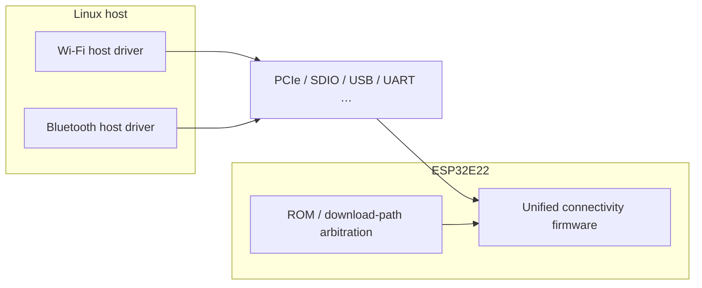

# Architecture overview

This document explains how the **Linux host**, **bus attachment**, and the **unified firmware on ESP32E22** relate to each other. It avoids conflating “two driver stacks on the host” with “multiple mutually exclusive firmware images on the chip.”

## Roles

- **Host (Linux)**: Runs Wi-Fi and/or Bluetooth host drivers; talks to firmware on the chip over the bus using the chip’s protocol.
- **Chip (ESP32E22)**: Runs a **single unified** connectivity firmware; handles RF, chip-specific protocol work, and **ROM / download-path arbitration** (exact behavior, including image selection, secure boot, and upgrade policy, follows chip documentation).
- **Prebuilt firmware**: Referenced as a Git submodule under `firmware/`, loaded by drivers or boot flow according to version.

## Host attachment (conceptual)

Common host interfaces include, but are not limited to:

- **PCIe 2.1** (Wi-Fi)
- **SDIO3.0** (Wi-Fi/BT)
- **USB** (BT)
- **UART** (BT)

Actual products follow hardware design; this repo documents concepts only, not a substitute for the datasheet.

## Conceptual diagram

Takeaways:

- The host may have **two separate driver modules** (Wi-Fi and Bluetooth) talking to the chip over the **same or different** channels.
- The chip side emphasizes a **single firmware image**; **ROM and load policy** decide which build runs and how upgrades work—see chip/SDK docs for detail; this file is only an orientation for readers of this aggregate repo.

## See also

- Submodule layout: [SUBMODULES.md](SUBMODULES.md).
- Firmware naming and driver minimum versions: [FIRMWARE.md](FIRMWARE.md).

*中文: [docs/zh/ARCHITECTURE.md](../zh/ARCHITECTURE.md)*
