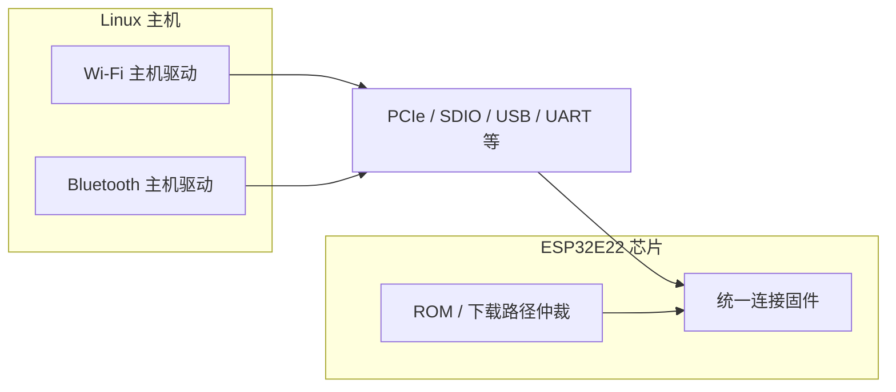

# 架构概览

本文描述 **Linux 主机**、**总线连接** 与 **ESP32E22 芯片侧统一固件** 之间的关系，避免将「主机上两个驱动栈」与「芯片上多套互斥固件」混为一谈。

## 角色划分

- **主机（Linux）**：运行 Wi-Fi 与（或）Bluetooth 主机驱动；通过总线与芯片上的固件协议交互。
- **芯片（ESP32E22）**：运行**统一**连接固件；负责射频、芯片侧协议处理，以及 **ROM/下载路径仲裁**（例如固件镜像选择、安全启动与升级策略的具体实现以芯片文档为准）。
- **预编译固件**：通常以二进制形式发布在 `firmware/`，由驱动或引导流程按版本加载到芯片。

## 主机连接方式（概念）

常见主机接口包括但不限于：

- **PCIe 2.1**（Wi-Fi）
- **SDIO3.0**（Wi-Fi/BT）
- **USB**（BT）
- **UART**（BT）

具体产品以硬件设计为准；本仓库文档保持接口层面的概念说明，不替代数据手册。

## 概念关系图

要点：

- 主机侧可以存在 **两个独立驱动模块**（Wi-Fi 与 Bluetooth），它们通过**相同或不同的通道**与芯片通信。
- 芯片侧强调 **单固件映像**（统一固件），由 **ROM 与加载策略** 决定启动哪一版本、如何升级；细节见芯片与 SDK 文档，此处仅作聚合仓读者导向说明。

## 另见

- 子模块如何接入：见 [SUBMODULES.md](SUBMODULES.md)。
- 固件文件命名与驱动最低版本：见 [FIRMWARE.md](FIRMWARE.md)。

*English: [docs/en/ARCHITECTURE.md](../en/ARCHITECTURE.md)*
